
<h1 align="center">废品买卖回收管理系统</h1>

## 简介
废品买卖回收管理系统：角色分为管理员、用户；功能包括废品管理、订单管理、用户管理、反馈管理、环保咨询、回收指南、个人中心等模块。    --计算机毕业设计源码；毕设源码；java毕业设计源码

## 联系方式

<h3 align="center">获取完整代码与数据库文件 + 微信：deepguan QQ: 86050149 QQ群: 783742310</h3>

<h3 align="center">可帮忙远程部署 包运行成功！提供远程部署、修改代码、设计文档指导、代码讲解等服务！</h3>

## 功能介绍（完整见运行截图）
管理员：具备管理系统的全面功能，包括用户管理、反馈管理、废品管理、公告管理、环保咨询管理、订单管理等。能够查看和回复用户反馈，对废品信息进行新增、修改与删除操作。提供订单的创建和管理功能，包括订单查询、查看详情及状态更新。支持基础数据管理，维护系统的正常运行和高效操作。拥有查看和处理用户咨询的权限，确保用户问题得到及时解决。

用户：可以通过系统进行注册、登录和退出。用户可以浏览废品相关信息，包括废品展示和详细信息查看。在个人中心，用户可以查看和编辑个人信息，上传头像，修改密码并管理废品订单。同时用户可以通过系统进行环保咨询和获取回收指南。用户能够提交订单，并选择合适的支付方式进行交易。提供反馈功能以便用户提交意见和建议，以帮助改进系统。

## 运行截图
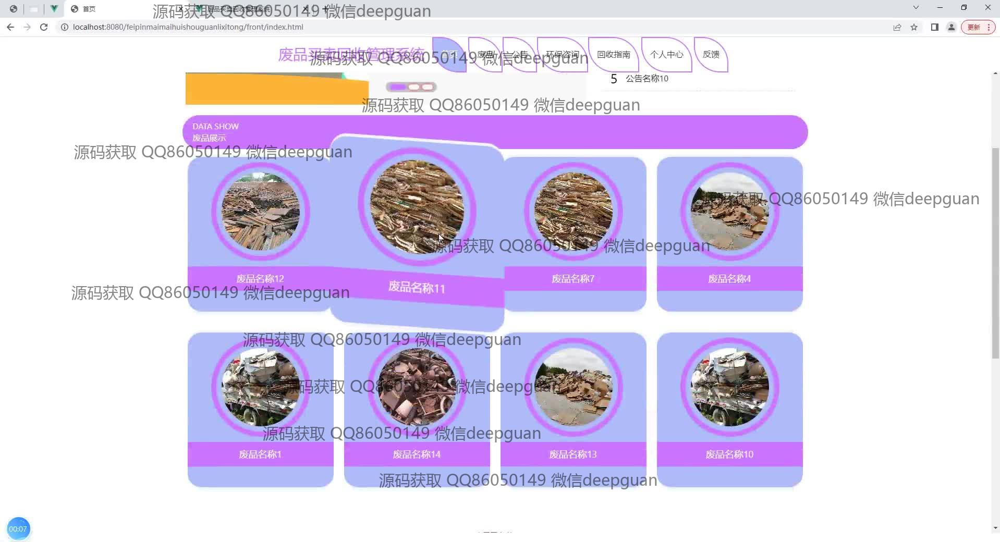
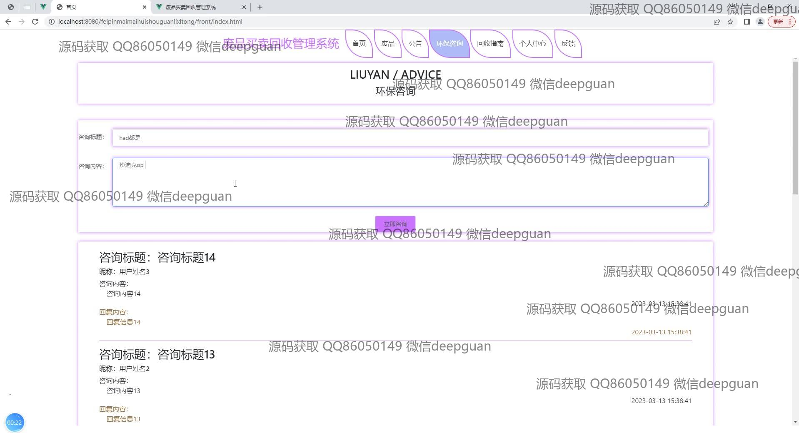
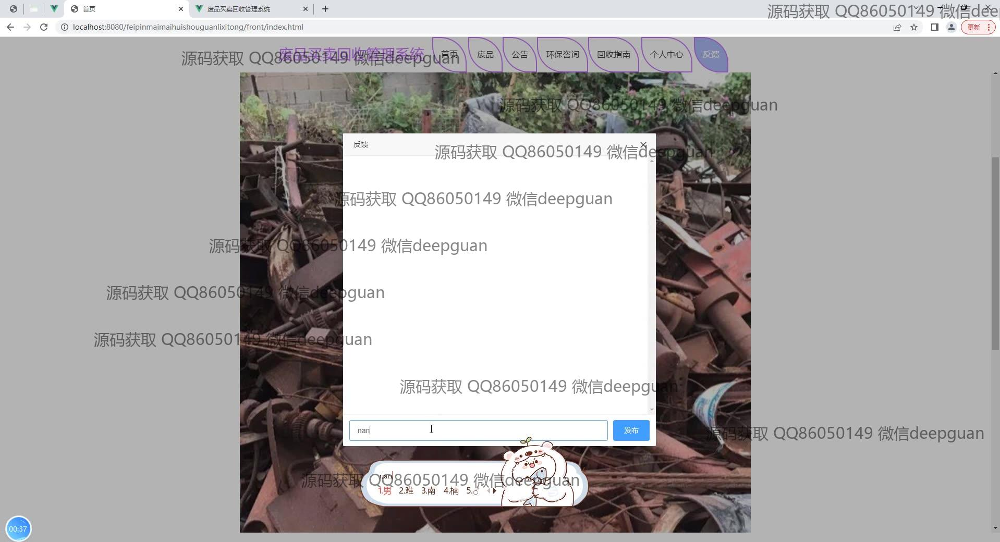
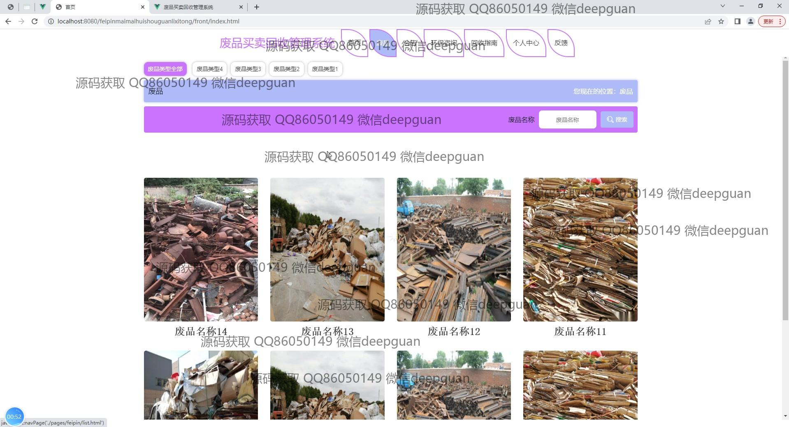

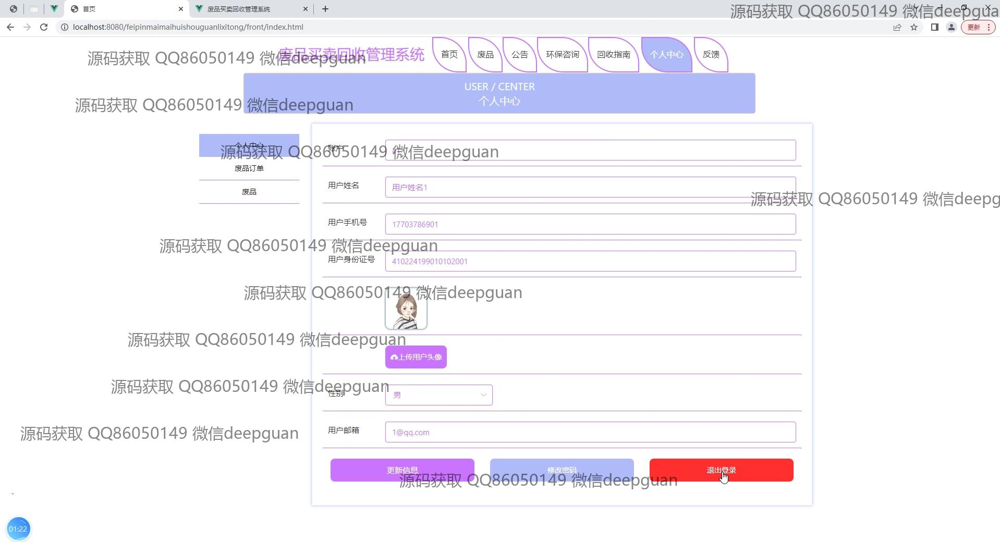
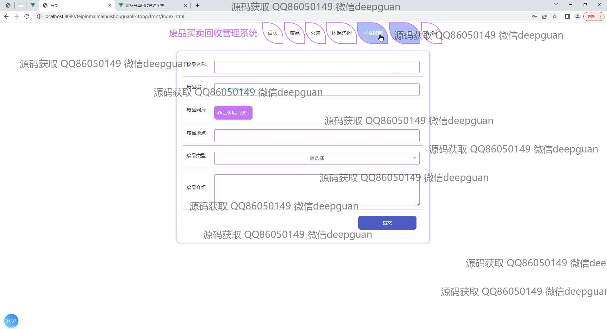
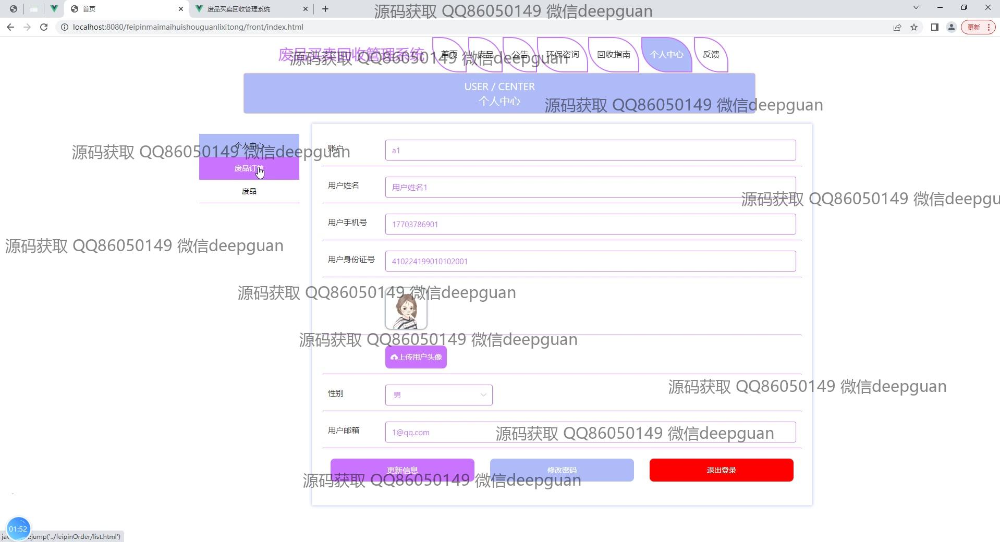

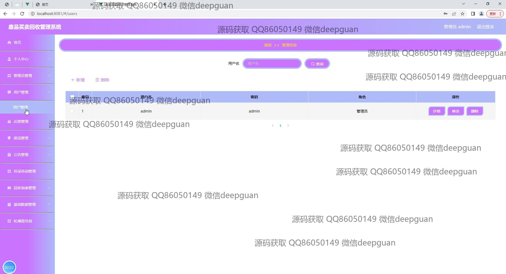
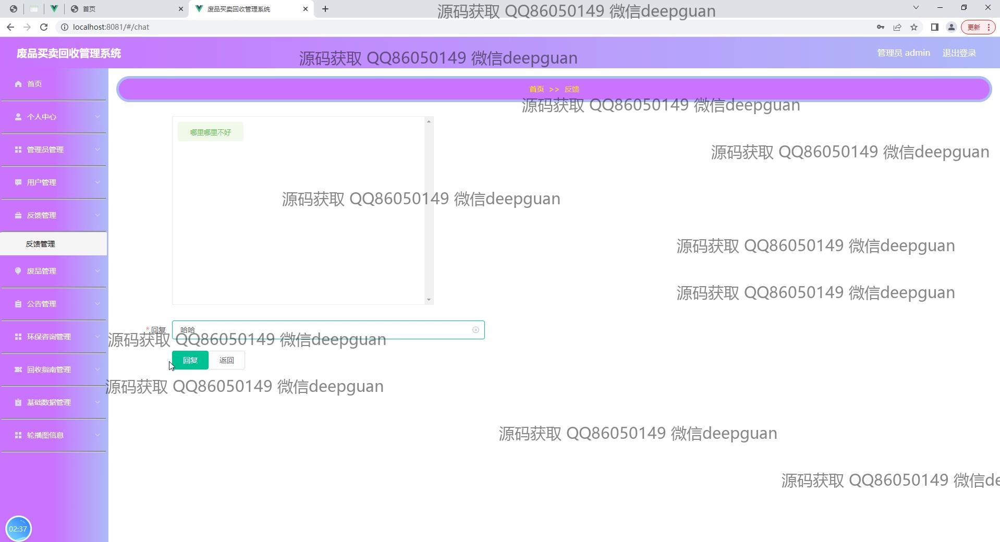
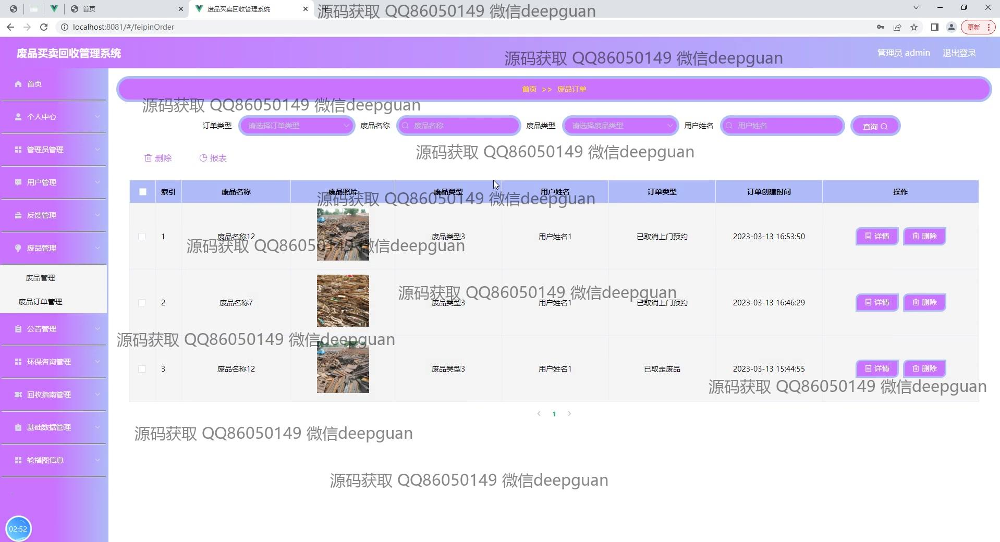
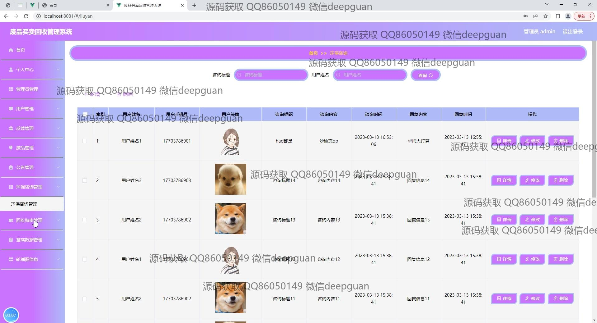

本代码来源于网络,仅供学习参考使用!

